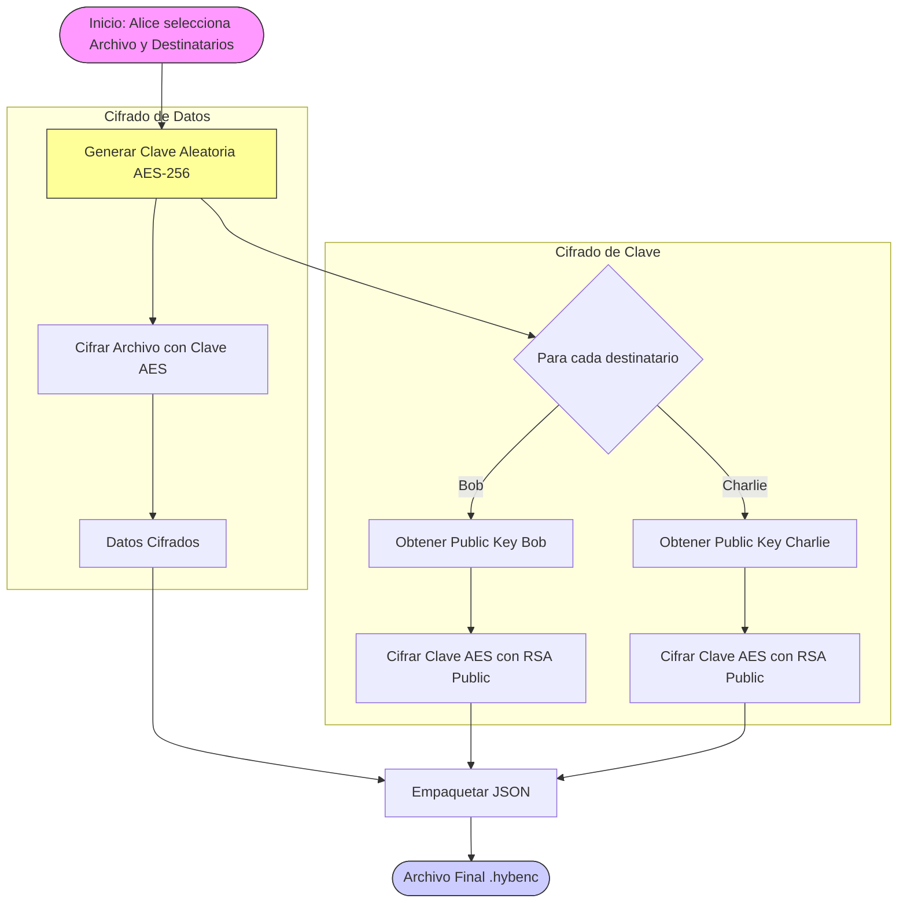
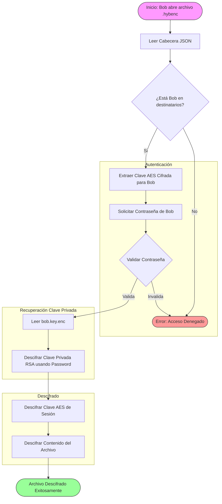
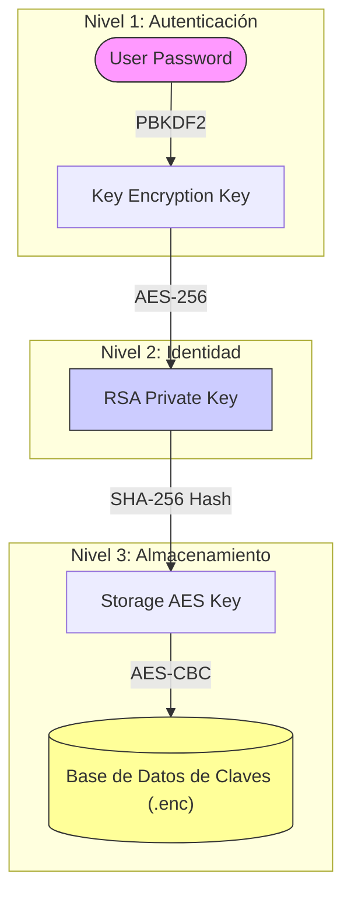
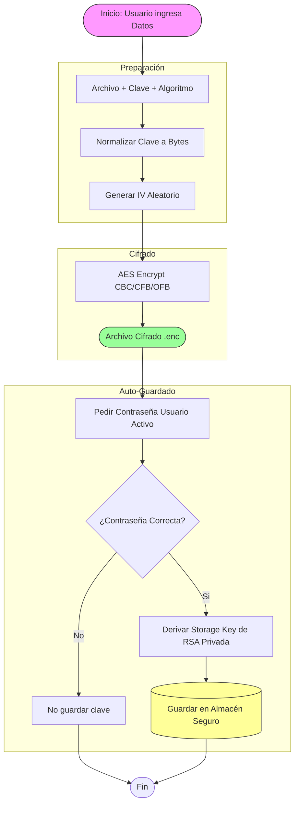

# Walkthrough: Métodos Criptográficos y Flujos de Datos

Este documento detalla los procesos internos de los diferentes métodos de cifrado utilizados en la aplicación, ilustrados mediante diagramas de flujo.

---

## 1. Cifrado Híbrido (Multi-Usuario)

Este es el método principal para compartir archivos de forma segura. Combina la eficiencia de **AES** para cifrar datos con la seguridad de **RSA** para intercambiar la clave.

### 📝 Proceso de Cifrado
El usuario "Alice" quiere enviar un archivo a "Bob" y "Charlie".

### 🔓 Proceso de Descifrado
"Bob" recibe el archivo cifrado y quiere leerlo.

---

## 2. Protección de Claves (Almacén de Usuario)

Sistema diseñado para almacenar las claves AES generadas manualmente o automáticamente, cifrándolas de forma que solo el usuario propietario pueda acceder a ellas.

### 🔐 Flujo de Seguridad: Cadena de Confianza

Este diagrama muestra cómo se protegen las claves AES almacenadas.

1.  **Nivel 1:** La contraseña del usuario desbloquea su **Clave Privada RSA**.
2.  **Nivel 2:** La Clave Privada RSA (que es única e intransferible) se usa para derivar matemáticamente una **Clave de Almacenamiento**.
3.  **Nivel 3:** Esa clave cifra el archivo JSON que contiene todas las claves AES guardadas.

---

## 3. Cifrado Simétrico Manual (AES Tradicional)

Cifrado directo de un archivo usando una clave proporcionada (o generada) manualmente.

---

## Resumen de Archivos Generados

| Tipo de Cifrado | Extensión | Contenido |
| :--- | :--- | :--- |
| **Híbrido** | `.hybenc` | Metadatos JSON (Keys cifradas con RSA) + Binario AES |
| **Simétrico** | `.enc` / `.aes` | Solo datos cifrados (IV suele ir prepend o separado) |
| **Clave Privada** | `.key.enc` | Salt + IV + Clave Privada RSA (Cifrada con Password) |
| **Almacén Claves** | `_keys.enc` | IV + Lista JSON de claves AES (Cifrada con RSA-derived key) |
