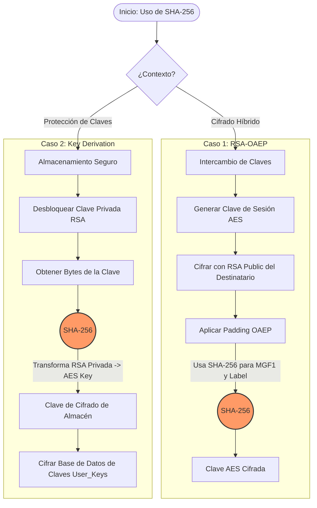

# Uso de Funciones Hash (SHA-256) en el Proyecto

Este documento ilustra los dos roles críticos que desempeña la función hash **SHA-256** en la seguridad de la aplicación: en el esquema de cifrado híbrido y en la protección del almacenamiento de claves.

## Diagrama de Flujo Global



---

## 1. Caso de Uso: Cifrado Híbrido (OAEP)

En el cifrado híbrido, cuando enviamos un archivo a otro usuario, ciframos la clave de sesión (AES) usando la clave pública (RSA) del destinatario. Para hacer este cifrado asimétrico seguro contra ataques de texto plano elegido, se utiliza el esquema de relleno **OAEP** (Optimal Asymmetric Encryption Padding), el cual requiere una función hash robusta.

**Archivo:** `certificacion.py`
**Función:** `encrypt_for_recipients`

```python
# certificacion.py (Extracto)

# ...
# Ciframos la clave simétrica (sym_key) usando la pública del destinatario
enc_sym = pub.encrypt(
    sym_key,
    padding.OAEP(
        mgf=padding.MGF1(algorithm=hashes.SHA256()), # <-- MGF1 usa SHA-256
        algorithm=hashes.SHA256(),                   # <-- Hash principal OAEP usa SHA-256
        label=None
    )
)
# ...
```

---

## 2. Caso de Uso: Protección de Claves (Derivación)

Para que el usuario pueda guardar múltiples claves AES sin tener que memorizar una contraseña para cada una, utilizamos su **Clave Privada RSA** (que ya está protegida por su contraseña principal) como fuente de entropía para "derivar" una clave de cifrado para el almacén.

Utilizamos SHA-256 para transformar los bytes de la clave privada RSA (que pueden ser muy largos y variables) en una cadena de bit fija y uniforme de 256 bits, perfecta para usarla como clave AES.

**Archivo:** `user_keys.py`
**Función:** `_encrypt_user_keys`

```python
# user_keys.py (Extracto)

# 1. Obtenemos los bytes crudos de la clave privada del usuario
key_material = user_priv.private_bytes(
    encoding=serialization.Encoding.DER,
    format=serialization.PrivateFormat.PKCS8,
    encryption_algorithm=serialization.NoEncryption()
)

# 2. Usamos SHA-256 para derivar una clave AES consistente y segura
#    Esto convierte la clave RSA (extensa) en exactamente 32 bytes (256 bits)
aes_key = hashlib.sha256(key_material).digest() # <-- SHA-256 para derivación

# 3. Usamos esa clave derivada para cifrar el almacén
cipher = Cipher(algorithms.AES(aes_key), modes.CBC(iv), backend=default_backend())
```
