# Estructura y Protección de Claves y Certificados

Este documento detalla técnicamente cómo se almacenan, protegen y estructuran los archivos críticos del sistema (Claves Privadas, Certificados y Almacén de Claves AES).

---

## 1. Protección de la Clave Privada (RSA)

La clave privada es el secreto más importante del usuario. Nunca se guarda en texto plano; se cifra utilizando la contraseña del usuario.

### 🛡️ Flujo de Generación y Protección

```mermaid
flowchart TD
    Start([Inicio: Crear Usuario]) --> Inputs[Identidad + Contraseña]
    
    subgraph KeyGen [Generación de Par RSA]
    Inputs --> GenRSA[Generar RSA-2048]
    GenRSA --> PubKey[Clave Pública]
    GenRSA --> PrivKey[Clave Privada]
    end
    
    subgraph Protection [Cifrado de Clave Privada]
    Inputs --> Salt[Generar Salt Aleatorio 16B]
    Salt --> KDF[PBKDF2-HMAC-SHA256]
    note1(100,000 iteraciones)
    KDF -.-> note1
    
    KDF --> WrapperKey[Clave de Envoltura (KEK)]
    
    PrivKey --> Encrypt[Cifrar con AES-256-CBC]
    WrapperKey --> Encrypt
    Encrypt --> CipherPriv[Clave Privada Cifrada]
    end
    
    subgraph FileWrite [Escritura en Disco]
    Salt --> Concat[Concatenar: Salt + IV + Ciphertext]
    CipherPriv --> Concat
    Concat --> FilePriv([Archivo: usuario.key.enc])
    end
    
    style Start fill:#f9f,stroke:#333
    style FilePriv fill:#ccf,stroke:#333
    style PrivKey fill:#fbb,stroke:#333
```

### 📂 Estructura del Archivo `.key.enc`

Archivo binario puro sin cabeceras JSON.

| Offset (Bytes) | Longitud | Contenido | Descripción |
| :--- | :--- | :--- | :--- |
| **0** | 16 | **Salt** | Usado en PBKDF2 para derivar la clave de descifrado. |
| **16** | 16 | **IV** | Vector de inicialización para AES-CBC. |
| **32** | Variable | **Ciphertext** | El *blob* de la clave privada RSA (PKCS8) cifrada. |

---

## 2. Emisión y Estructura del Certificado

El certificado actúa como la "Identidad Digital" pública del usuario.

### 📜 Flujo de Certificación


### 📂 Estructura del Archivo `.cert`

Archivo de texto en formato JSON.

```json
{
  "identity": "Alice",
  "public_key_pem": "-----BEGIN PUBLIC KEY-----\n...",
  "signature": "Base64_Encoded_Signature..."
}
```

---

## 3. Almacén Seguro de Claves AES

Permite al usuario guardar las claves simétricas de sus archivos para no tener que recordarlas.

### 🔐 Flujo de Acceso y Guardado

```mermaid
flowchart TD
    Start([Acceso al Almacén]) --> Auth[Solicitar Contraseña]
    
    subgraph Unlock [Desbloqueo]
    Auth --> DecUser[Descifrar Clave Privada Usuario]
    DecUser --> GenStorageKey[Derivar StorageKey de PrivateKey]
    note3(Hash de la Clave Privada)
    GenStorageKey -.-> note3
    end
    
    subgraph Operation [Operación de Guardado]
    GenStorageKey --> EncVault[Cifrar/Descifrar Vault AES]
    EncVault --> ListKeys[Lista de Claves en Memoria]
    end
    
    subgraph Update [Actualización]
    ListKeys --> Append[Añadir Nueva Clave]
    Append --> ReEnc[Recifrar Vault Completo]
    ReEnc --> SaveFile([Archivo: usuario_keys.enc])
    end
    
    style Start fill:#f9f,stroke:#333
    style SaveFile fill:#ccf,stroke:#333
    style DecUser fill:#fbb,stroke:#333
```



### 📂 Estructura del Archivo `_keys.enc`

Archivo binario que contiene un JSON cifrado.

| Offset (Bytes) | Longitud | Contenido | Descripción |
| :--- | :--- | :--- | :--- |
| **0** | 16 | **IV** | Vector de inicialización para el cifrado del almacén. |
| **16** | Variable | **Ciphertext** | Contenido JSON cifrado con la `StorageKey`. |

**Contenido JSON Descifrado (Ejemplo):**

```json
[
  {
    "timestamp": "2025-12-16T10:00:00",
    "algorithm": "AES-256",
    "mode": "CBC",
    "key": "a1b2c3d4...", 
    "iv": "e5f6g7h8...",
    "filename": "secreto.txt"
  }
]
```
