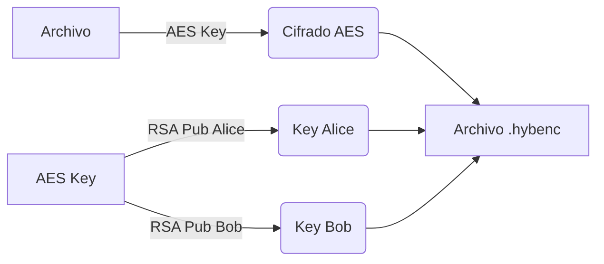

# GUÍA DE PRESENTACIÓN: APLICACIÓN DE CRIPTOGRAFÍA HÍBRIDA

**Duración Total:** 15 minutos  
**Objetivo:** Presentar la arquitectura, algoritmos y funcionalidades de la aplicación desarrollada.

---

## 🕒 DIAPOSITIVA 1: Título y Portada (0:30 min)

**Contenido:**

- **Título:** Sistema de Cifrado Híbrido y Gestión de Certificados
- **Subtítulo:** Implementación de Infraestructura de Clave Pública (PKI) y AES
- **Autor:** [Tu Nombre]
- **Asignatura:** Teoría de Códigos y Criptografía

**Notas para el orador:**

- Presentación del proyecto.
- Objetivo principal: Desarrollar una aplicación de escritorio segura para el intercambio confidencial de archivos entre usuarios autenticados.

---

## 🕒 DIAPOSITIVA 2: Resumen del Proyecto y Objetivos (1:30 min)

**Contenido:**

- **Objetivo General:** Sistema seguro de cifrado de archivos multi-usuario.
- **Cobertura de Requisitos (100% Implementados):**
  - ✅ Generación y gestión de certificados digitales.
  - ✅ Cifrado Híbrido (AES + RSA).
  - ✅ Autenticación de usuarios segura (PBKDF2).
  - ✅ Infraestructura de Clave Pública (CA simulada).
  - ✅ Recuperación de archivos ante pérdida de contraseña (vía clave privada).

**Visual:**

- Lista de requisitos con "checkmarks" verdes.
- Gráfico circular simple: "9/9 Requisitos Completados".

**Notas para el orador:**

- Destacar que se han cubierto todos los hitos propuestos.
- Mencionar la importancia de la seguridad en el almacenamiento de claves privadas.

---

## 🕒 DIAPOSITIVA 3: Introducción Técnica - Algoritmos y Librerías (2:00 min)

**Contenido:**

- **Lenguaje:** Python 3.11+
- **Librería Principal:** `cryptography.io` (Estándar de facto en Python).
- **Algoritmos Simétricos (Cifrado de Datos):**
  - **AES (Advanced Encryption Standard):** Bloques de 128 bits.
  - **Modos:** CBC (Cipher Block Chaining) con IV aleatorio.
  - **Longitudes:** 128, 192, 256 bits.
  - **Padding:** PKCS7.
- **Algoritmos Asimétricos (Intercambio de Claves):**
  - **RSA:** Claves de 2048 bits.
  - **Firma Digital:** RSA + SHA-256 (PKCS1v15).
  - **Cifrado de Claves AES:** RSA-OAEP + MGF1 + SHA-256.

**Notas para el orador:**

- Explicar por qué se eligió AES-CBC (seguridad/compatibilidad) y RSA-2048 (estándar actual).
- Justificar el uso de `cryptography` por sobre implementaciones "manuales" inseguras.

---

## 🕒 DIAPOSITIVA 4: Arquitectura de Seguridad y Protocolos (2:30 min)

**Contenido:**

- **Gestión de Claves Privadas:**
  - Derivación: PBKDF2Hmac + SHA256 (100,000 iteraciones).
  - Salt único por usuario (prevención de Rainbow Tables).
  - Almacenamiento cifrado (AES-256).
- **Estructura de Archivos Cifrados (.hybenc):**
  - Formato JSON + Binario.
  - Cabecera: Metadatos, IV, Lista de Destinatarios (Claves AES cifradas con RSA).
  - Cuerpo: Datos cifrados.

**Visual:**

- Diagrama de capas:
  `[ Usuario ] -> [ GUI (Tkinter) ] -> [ Lógica (certificacion.py) ] -> [ Criptografía ]`

**Notas para el orador:**

- Énfasis en que la contraseña del usuario nunca se guarda, se usa para derivar la clave que descifra su clave privada.

---

## 🕒 DIAPOSITIVA 5: Diagrama de Cifrado Híbrido (2:00 min)

**Contenido:**

- **Protocolo de Cifrado paso a paso:**
  1. Generación de clave AES aleatoria (Sesión).
  2. Cifrado del archivo con AES-256.
  3. Para cada destinatario:
     - Obtener Certificado -> Extraer Clave Pública.
     - Cifrar clave de Sesión con RSA Público del destinatario.
  4. Empaquetado final.

**Visual:**



---

## 🕒 DIAPOSITIVA 6: Diagrama de Descifrado (1:30 min)

**Contenido:**

- **Protocolo de Descifrado:**
  1. Lectura de cabecera JSON.
  2. Identificación del usuario activo.
  3. Solicitud de contraseña -> Descifrado de Clave Privada RSA.
  4. Descifrado de la Clave de Sesión (RSA Privado).
  5. Descifrado del archivo (AES).

**Visual:**

- Diagrama inverso al anterior, mostrando el flujo desde el archivo cifrado hasta el texto plano.

---

## 🕒 DIAPOSITIVA 7: Funcionalidad - Manual de Usuario Rápido (2:00 min)

**Contenido:**

- **Acciones Principales:**
  1. **Gestión de Identidades:** Crear usuario, generar certificado.
  2. **Cifrado Múltiple:** Selección de destinatarios en lista con validación visual.
  3. **Descifrado:** Detección automática de identidad y validación de contraseña.
  4. **Gestión de Claves:** Almacenamiento seguro y recuperación de claves usadas.
- **Interfaz (GUI):**
  - Uso de Combobox para selección de usuario activo.
  - Validaciones previas (contraseña, selección de archivo).

**Visual:**

- Capturas de pantalla de la GUI:
  - Ventana principal.
  - Diálogo de selección de destinatarios.
  - Diálogo de solicitud de contraseña.

**Notas para el orador:**

- Mencionar la "usabilidad mejorada": feedback visual, auto-inclusión, guardado automático.

---

## 🕒 DIAPOSITIVA 8: Porciones de Código - Criptografía Asimétrica (1:30 min)

**Contenido:**

- **Firma de Certificados (Python):**

```python
# Firma digital con CA
signature = ca_priv.sign(
    public_key_bytes + identity_bytes,
    padding.PKCS1v15(),
    hashes.SHA256()
)
```

- **Cifrado de Clave de Sesión (RSA):**

```python
# Cifrado Híbrido (RSA-OAEP)
encrypted_sym_key = recipient_public_key.encrypt(
    symmetric_key,
    padding.OAEP(
        mgf=padding.MGF1(algorithm=hashes.SHA256()),
        algorithm=hashes.SHA256(),
        label=None
    )
)
```

**Notas para el orador:**

- Resaltar el uso de padding seguro (OAEP) en lugar de PKCS1v15 para cifrado, siguiendo estándares actuales.

---

## 🕒 DIAPOSITIVA 9: Porciones de Código - Cifrado Simétrico y Protección (1:00 min)

**Contenido:**

- **Derivación de Clave (PBKDF2):**

```python
kdf = PBKDF2HMAC(
    algorithm=hashes.SHA256(),
    length=32,
    salt=salt,
    iterations=100000
)
key = kdf.derive(password.encode())
```

**Notas para el orador:**

- Explicar la importancia del número de iteraciones (100k) para mitigar fuerza bruta.

---

## 🕒 DIAPOSITIVA 10: Conclusiones, Bibliografía y Librerías (0:30 min)

**Contenido:**

- **Bibliografía y Recursos:**
  - NIST (Estándares AES/RSA).
  - Documentación `cryptography.io`.
  - Python Tkinter Docs.
- **Conclusiones:**
  - Sistema robusto y escalable.
  - Integridad y confidencialidad garantizadas.
  - User Experience (UX) priorizada en la última fase.

**Preguntas y Respuestas**

---
