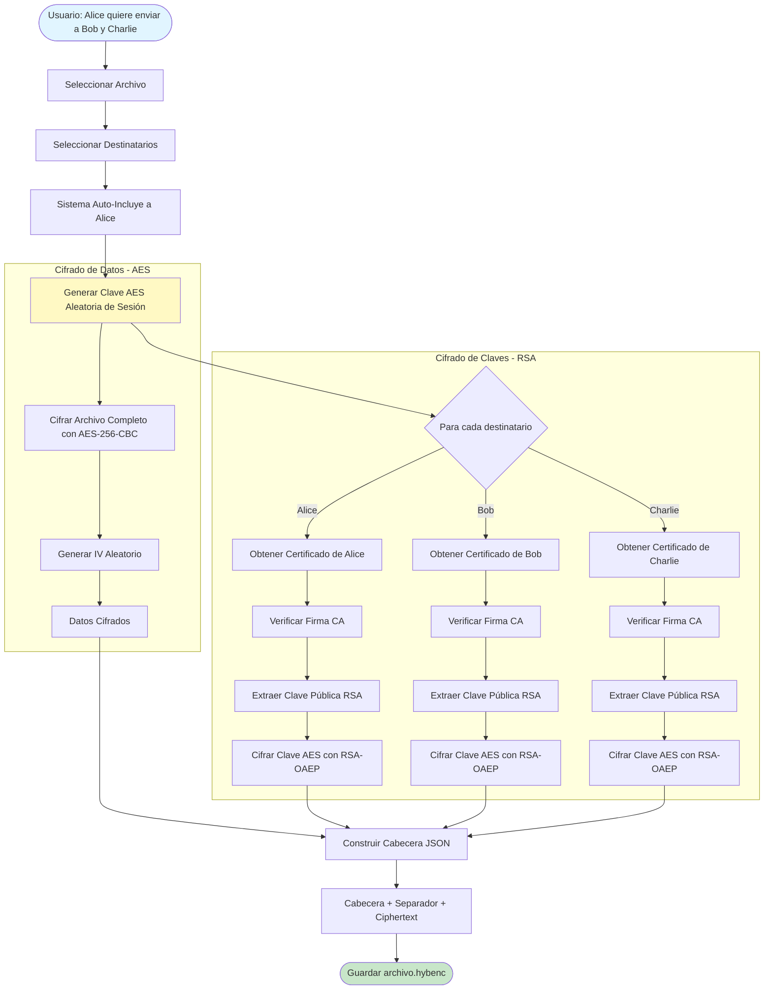
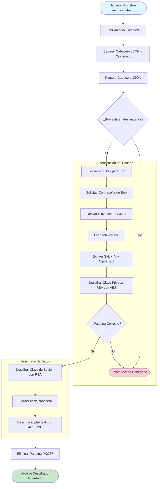

# Sistema de Cifrado Híbrido y Gestión de Certificados Digitales
## Implementación Integral de Criptografía Simétrica, Asimétrica y PKI

**Asignatura:** Teoría de Códigos y Criptografía  
**Proyecto:** TYP3_$HIT - Aplicación de Cifrado y Descifrado de Archivos  
**Fecha:** Diciembre 2025

---

## Introducción

El presente documento constituye la recopilación y unificación de las tres entregas principales desarrolladas durante el curso, conformando un **sistema completo de seguridad criptográfica** para el cifrado, descifrado y compartición segura de archivos entre múltiples usuarios. 

La aplicación **TYP3_$HIT** implementa una arquitectura de seguridad de múltiples capas que combina:

1. **Criptografía Simétrica (AES)** - Para el cifrado eficiente de datos
2. **Criptografía Asimétrica (RSA)** - Para el intercambio seguro de claves
3. **Infraestructura de Clave Pública (PKI)** - Para la autenticación y certificación digital mediante firmas

Este sistema representa una solución práctica y funcional que demuestra la aplicación de los conceptos teóricos vistos en clase, ofreciendo un nivel de seguridad comparable a sistemas profesionales de gestión documental cifrada.

---

## Resumen Ejecutivo del Proyecto

### 🎯 Objetivo General

Desarrollar una aplicación de escritorio segura que permita a múltiples usuarios:
- Cifrar archivos de cualquier tipo con garantías de confidencialidad
- Compartir archivos cifrados entre usuarios autenticados
- Verificar la identidad de remitentes mediante certificados digitales
- Gestionar claves criptográficas de forma segura y transparente

### ✅ Requisitos Implementados (100%)

El proyecto cubre de forma completa todos los requisitos planteados:

| Componente                   | Estado | Descripción                                      |
| :--------------------------- | :----: | :----------------------------------------------- |
| **Cifrado Simétrico**        |   ✅    | AES-128/192/256 en modos CBC, CFB, OFB           |
| **Cifrado Asimétrico**       |   ✅    | RSA-2048 con padding OAEP para claves            |
| **Certificación Digital**    |   ✅    | PKI completa con CA simulada y firmas SHA-256    |
| **Gestión de Identidades**   |   ✅    | Creación y validación de certificados de usuario |
| **Cifrado Híbrido**          |   ✅    | Combinación AES+RSA para múltiples destinatarios |
| **Protección de Claves**     |   ✅    | PBKDF2 (100k iteraciones) + AES-256              |
| **Almacenamiento Seguro**    |   ✅    | Claves privadas cifradas con contraseña          |
| **Recuperación de Archivos** |   ✅    | Auto-inclusión del remitente como destinatario   |
| **Interfaz de Usuario**      |   ✅    | GUI intuitiva con Tkinter y validaciones         |

### 🔧 Stack Tecnológico

- **Lenguaje:** Python 3.11+
- **Librería Criptográfica:** `cryptography.io` (Estándar industrial)
- **Interfaz Gráfica:** Tkinter (Nativa de Python)
- **Gestión de Archivos:** `pathlib`, `json`, `secrets`

---

## Arquitectura del Sistema

### 📐 Capas de Seguridad

El sistema implementa un modelo de seguridad en capas (Defense in Depth):

```
┌─────────────────────────────────────────────────────────┐
│                    Capa de Usuario                      │
│              (GUI - typeShit_gui.py)                    │
└────────────────────┬────────────────────────────────────┘
                     │
┌────────────────────▼────────────────────────────────────┐
│              Capa de Lógica de Negocio                  │
│        (typeShit.py - Gestión de operaciones)           │
└────────────────────┬────────────────────────────────────┘
                     │
┌────────────────────▼────────────────────────────────────┐
│           Capa de Certificación y PKI                   │
│     (certificacion.py - CA, Usuarios, Híbrido)          │
└────────────────────┬────────────────────────────────────┘
                     │
┌────────────────────▼────────────────────────────────────┐
│          Capa de Primitivas Criptográficas              │
│         (aes.py, rsa.py - Algoritmos base)              │
└─────────────────────────────────────────────────────────┘
```

### 🔐 Componentes Principales

#### 1. **aes.py** - Cifrado Simétrico (Entrega 1)

**Funcionalidad:**
- Implementación de AES en tres tamaños de clave (128, 192, 256 bits)
- Soporte para múltiples modos de operación (CBC, CFB, OFB)
- Padding PKCS7 automático para bloques de 128 bits
- Generación de IV (Vector de Inicialización) aleatorio único por operación

**Características de Seguridad:**
- IV generado con `secrets.token_bytes()` (CSPRNG)
- Validación estricta de tamaños de clave
- Eliminación segura de datos sensibles de memoria
- Extensión `.enc` para archivos cifrados

**Uso Típico:**
```python
aes = AES()
# Cifrado
iv = aes.encriptar_archivo_AES(
    file_path="documento.pdf",
    modeAES="CBC",
    key=clave_32_bytes,
    key_length_bits=256,
    output_path="documento.pdf.enc"
)

# Descifrado
aes.desencriptar_archivo_AES(
    file_path="documento.pdf.enc",
    modeAES="CBC",
    key=clave_32_bytes,
    iv=iv_guardado,
    key_length_bits=256,
    output_path="documento.pdf"
)
```

---

#### 2. **rsa.py** - Cifrado Asimétrico (Entrega 2)

**Funcionalidad:**
- Cifrado y descifrado con claves RSA de 2048 bits
- Padding OAEP (Optimal Asymmetric Encryption Padding) con SHA-256
- Soporte para claves en formato PEM (archivo o bytes)
- Extensión `.enc` para datos cifrados con RSA

**Características de Seguridad:**
- Uso de OAEP en lugar de PKCS1v15 (más seguro contra ataques)
- MGF1 (Mask Generation Function) con SHA-256
- Validación de formato PEM en claves

**Limitaciones:**
- RSA solo puede cifrar datos de tamaño limitado (~214 bytes para RSA-2048)
- Por ello, se usa principalmente para cifrar claves AES (32 bytes)

**Uso Típico:**
```python
rsa = RSA()
# Cifrar clave de sesión AES con clave pública del destinatario
rsa.encriptar_archivo_RSA(
    file_path="session_key.bin",
    clavePublica="bob_public.pem",
    output_path="session_key.enc"
)

# Descifrar con clave privada
rsa.desencriptar_archivo_RSA(
    file_path="session_key.enc",
    clavePrivada="bob_private.pem",
    output_path="session_key.bin"
)
```

---

#### 3. **certificacion.py** - PKI y Firmas Digitales (Entrega 3)

**Funcionalidad:**
- Autoridad de Certificación (CA) simulada
- Generación de certificados digitales para usuarios
- Firma digital con RSA + SHA-256
- Cifrado híbrido para múltiples destinatarios
- Protección de claves privadas con PBKDF2

**Componentes:**

##### 3.1. Autoridad de Certificación (CA)
```python
def create_ca(aes_key_hex: str = None, key_size: int = 2048)
```
- Genera par de claves RSA para la CA
- Crea `license.txt` con clave AES-256 para proteger la CA
- Cifra la clave privada de la CA con AES-256
- Estructura de archivos:
  - `certs/ca/ca_public.pem` - Clave pública de la CA
  - `certs/ca/ca_private.enc` - Clave privada cifrada
  - `certs/license.txt` - Clave AES maestra (hexadecimal)

##### 3.2. Gestión de Usuarios
```python
def create_user(identity: str, password: str, key_size: int = 2048)
```
- Genera par de claves RSA para el usuario
- Crea certificado firmado por la CA
- Protege la clave privada con derivación PBKDF2 de la contraseña
- Estructura de archivos por usuario:
  - `certs/users/{identity}.cert` - Certificado (JSON con firma)
  - `certs/users/{identity}.key.enc` - Clave privada cifrada

**Formato del Certificado:**
```json
{
  "identity": "Alice",
  "public_key_pem": "-----BEGIN PUBLIC KEY-----\n...",
  "signature": "base64_encoded_signature"
}
```

**Estructura de Clave Privada Cifrada:**
```
[16 bytes: Salt] || [16 bytes: IV] || [Ciphertext: AES-256-CBC]
```

##### 3.3. Cifrado Híbrido Multi-Usuario
```python
def encrypt_for_recipients(
    input_file: str,
    recipients: list,
    algorithm: str,
    mode: str,
    output_file: str = None
) -> str
```

**Proceso:**
1. Genera clave AES aleatoria (clave de sesión)
2. Cifra el archivo completo con AES
3. Para cada destinatario:
   - Obtiene su certificado
   - Extrae su clave pública RSA
   - Cifra la clave de sesión con RSA-OAEP
4. Empaqueta todo en formato `.hybenc`

**Formato de Archivo Híbrido:**
```
[Cabecera JSON] + "\n---CERTMETA-END---\n" + [Ciphertext AES]
```

**Cabecera JSON:**
```json
{
  "algorithm": "AES-256",
  "mode": "CBC",
  "iv": "hex_encoded_iv",
  "recipients": [
    {
      "identity": "Alice",
      "enc_key": "base64_encoded_aes_key_encrypted_with_alice_rsa"
    },
    {
      "identity": "Bob",
      "enc_key": "base64_encoded_aes_key_encrypted_with_bob_rsa"
    }
  ]
}
```

##### 3.4. Descifrado Híbrido
```python
def decrypt_hybrid_file(
    hybrid_file: str,
    identity: str,
    password: str,
    output_file: str = None
) -> str
```

**Proceso:**
1. Lee y parsea la cabecera JSON
2. Verifica que el usuario esté en la lista de destinatarios
3. Solicita contraseña del usuario
4. Descifra la clave privada RSA del usuario con PBKDF2(password)
5. Descifra la clave de sesión AES con RSA privada
6. Descifra el archivo con la clave de sesión

**Seguridad:**
- Control de acceso: solo destinatarios listados pueden descifrar
- Autenticación: contraseña necesaria para acceder a clave privada
- Integridad: cualquier modificación causará fallo en descifrado

---

#### 4. **typeShit.py** - Gestión de Claves y Almacenamiento

**Funcionalidad:**
- Gestión centralizada de operaciones de cifrado/descifrado
- Almacenamiento seguro de claves AES utilizadas
- Normalización de entradas (hex, UTF-8, bytes)
- Generación de claves aleatorias

**Sistema de Almacenamiento de Claves:**

```python
def store_key(key: bytes, iv: bytes, algorithm: str, mode: str)
def get_stored_keys() -> list
```

**Mecanismo de Protección:**
1. Las claves se guardan en `Keys/keys.txt` (JSON)
2. El archivo se cifra híbridamente:
   - Clave AES-256 aleatoria cifra `keys.txt` → `keys.txt.enc`
   - Clave pública RSA cifra la clave AES → `keys.txt.key`
3. `keys.txt` plano se elimina inmediatamente
4. Para leer claves:
   - Se descifra `keys.txt.key` con clave privada RSA → clave AES
   - Se descifra `keys.txt.enc` con clave AES → claves en JSON
   - Se leen las claves
   - Se vuelve a eliminar `keys.txt`

**Formato de Entrada de Clave:**
```json
{
  "timestamp": "2025-12-21T03:27:12",
  "algorithm": "AES-256",
  "mode": "CBC",
  "key": "hex_encoded_32_bytes",
  "iv": "hex_encoded_16_bytes"
}
```

**Ventajas:**
- Historial completo de claves utilizadas
- Recuperación automática de IV para descifrado
- Protección con las claves RSA del usuario activo
- Evita almacenar claves en texto plano

---

#### 5. **typeShit_gui.py** - Interfaz de Usuario

**Funcionalidad:**
- Interfaz gráfica completa con Tkinter
- 4 modos de operación principales:
  1. **Cifrado Simétrico Manual** (AES directo)
  2. **Descifrado Simétrico Manual**
  3. **Cifrado Híbrido Multi-Usuario**
  4. **Descifrado Híbrido**
- Gestión de certificados de usuario
- Visualización de claves almacenadas

**Características de UX:**
- Selección visual de destinatarios con checkboxes
- Validación de entradas en tiempo real
- Feedback visual de operaciones
- Auto-inclusión del remitente al cifrar
- Visualización de certificados válidos/inválidos

---

## Flujos de Datos Completos

### 📤 Flujo de Cifrado Híbrido



### 📥 Flujo de Descifrado Híbrido



---

## Protocolos de Seguridad Implementados

### 🔒 1. Protección de Claves Privadas (PBKDF2)

**Problema:** Las claves privadas RSA no pueden guardarse en texto plano.

**Solución:**
```
Contraseña del Usuario
    ↓
PBKDF2-HMAC-SHA256 (100,000 iteraciones) + Salt único
    ↓
Clave de Cifrado AES-256 (KEK - Key Encryption Key)
    ↓
Cifrar Clave Privada RSA con AES-256-CBC
    ↓
Guardar: Salt || IV || Ciphertext
```

**Parámetros de Seguridad:**
- **Algoritmo:** PBKDF2-HMAC-SHA256
- **Iteraciones:** 100,000 (resistencia a fuerza bruta)
- **Salt:** 16 bytes aleatorios (evita Rainbow Tables)
- **Longitud de Clave Derivada:** 32 bytes (AES-256)

**Código:**
```python
def _derive_key_from_password(password: str, salt: bytes) -> bytes:
    kdf = PBKDF2HMAC(
        algorithm=hashes.SHA256(),
        length=32,
        salt=salt,
        iterations=100_000,
        backend=default_backend()
    )
    return kdf.derive(password.encode("utf-8"))
```

---

### 🔒 2. Firma Digital de Certificados

**Propósito:** Garantizar que un certificado fue emitido por la CA y no ha sido modificado.

**Proceso de Firma (Creación de Usuario):**
```
1. Generar par de claves RSA para usuario
2. Extraer clave pública en formato PEM
3. Concatenar: public_key_pem + identity (en bytes)
4. Firmar con RSA privado de CA + PKCS1v15 + SHA-256
5. Guardar certificado: {identity, public_key_pem, signature_base64}
```

**Proceso de Verificación:**
```
1. Leer certificado (JSON)
2. Cargar CA pública
3. Extraer firma (base64 → bytes)
4. Verificar: ca_public.verify(signature, public_key_pem + identity)
5. Si falla → certificado inválido o falsificado
```

**Código:**
```python
# Firma (en create_user)
signature = ca_priv.sign(
    pub_pem + ident_bytes,
    padding.PKCS1v15(),
    hashes.SHA256()
)

# Verificación (en list_certificates)
ca_pub.verify(
    sig,
    cert["public_key_pem"].encode() + cert["identity"].encode(),
    padding.PKCS1v15(),
    hashes.SHA256()
)
```

**Seguridad:**
- Cualquier modificación en `identity` o `public_key_pem` invalida la firma
- Solo la CA puede emitir certificados válidos
- Previene ataques man-in-the-middle en intercambio de claves

---

### 🔒 3. Cifrado Híbrido (AES + RSA)

**Ventajas:**
- **Eficiencia:** AES es ~1000x más rápido que RSA
- **Capacidad:** RSA tiene límite de tamaño, AES no
- **Seguridad:** Combina fortalezas de ambos

**Esquema:**
```
Archivo Grande (ej: 100 MB PDF)
    ↓
Clave de Sesión AES aleatoria de 32 bytes
    ↓
Cifrado AES-256-CBC → Ciphertext (100 MB cifrados)
    ↓
Para cada destinatario:
    Clave Sesión (32 bytes) → [RSA-OAEP con su clave pública] → enc_key (256 bytes)
    ↓
Archivo Final:
    JSON Header (< 1 KB) + Separator + Ciphertext (100 MB)
```

**Eficiencia:**
- Un archivo de 100 MB se cifra **una sola vez** con AES
- Solo se cifran 32 bytes por destinatario con RSA (rápido)
- Agregar un destinatario adicional solo añade ~256 bytes al archivo

---

## Análisis de Seguridad

### ✅ Fortalezas del Sistema

1. **Uso de Estándares Probados:**
   - AES-256 (aprobado por NSA para información clasificada)
   - RSA-2048 (estándar actual, equivalente a ~112 bits de seguridad)
   - SHA-256 (resistente a colisiones)

2. **Protección en Profundidad:**
   - Claves privadas nunca en texto plano
   - PBKDF2 con 100k iteraciones (lento para atacantes)
   - IV aleatorio único por cada cifrado

3. **Gestión Segura de Claves:**
   - Separación de claves: sesión vs. largo plazo
   - Rotación automática (nueva clave por archivo)
   - Almacenamiento cifrado de historial

4. **Control de Acceso:**
   - Solo destinatarios listados pueden descifrar
   - Autenticación requerida (contraseña)
   - Verificación de certificados antes de usar claves

5. **Integridad:**
   - Firmas digitales en certificados
   - Padding PKCS7 detecta manipulación
   - Modo CBC autentica implícitamente los bloques

### ⚠️ Limitaciones y Consideraciones

1. **Sistema de Prueba:**
   - La CA es simulada (en producción se usarían X.509 reales)
   - No hay revocación de certificados
   - No hay fecha de expiración

2. **Contra Ataques Sofisticados:**
   - **CBC Padding Oracle:** Mitigado por no revelar errores de padding específicos
   - **Timing Attacks:** La librería `cryptography` incluye mitigaciones
   - **Side-Channel:** No se protege contra análisis de consumo eléctrico (no es el objetivo)

3. **Gestión de Contraseñas:**
   - Contraseñas débiles comprometen claves privadas
   - No hay política de complejidad forzada
   - No hay límite de intentos (posible fuerza bruta local)

4. **Almacenamiento:**
   - `license.txt` debe protegerse físicamente (compromete toda la CA)
   - Claves RSA en `Keys/` deben tener permisos restrictivos

---

## Casos de Uso Prácticos

### Caso 1: Compartir Documento Confidencial

**Escenario:** Alice quiere enviar un contrato PDF a Bob y Charlie.

**Pasos:**
1. Alice crea su usuario (si no existe): `create_user("Alice", "password123")`
2. Bob y Charlie hacen lo mismo
3. Alice selecciona el archivo PDF en la GUI
4. Alice marca a Bob y Charlie como destinatarios
5. Sistema cifra el PDF y genera `contrato.pdf.hybenc`
6. Alice envía el archivo por cualquier canal (email, USB, nube)
7. Bob abre el archivo, introduce su contraseña, y recupera el PDF original
8. Charlie hace lo mismo independientemente

**Seguridad:**
- Aunque Alice envíe por email inseguro, el archivo está protegido
- Si un atacante intercepta, no puede descifrar sin contraseñas de Bob/Charlie
- Alice también puede descifrar (auto-inclusión)

---

### Caso 2: Recuperación de Archivo Olvidado

**Escenario:** Alice cifró un archivo hace meses y olvidó la clave AES usada.

**Solución (si usó cifrado híbrido):**
1. Alice se incluyó automáticamente como destinataria
2. Abre el archivo `.hybenc`
3. Introduce su contraseña de usuario
4. El sistema recupera la clave AES de la cabecera
5. Descifra el archivo sin necesidad de recordar la clave AES

**Solución (si usó cifrado simétrico manual):**
1. Alice accede al sistema de almacenamiento de claves
2. Introduce su contraseña de usuario
3. Revisa el historial de claves guardadas (con timestamps)
4. Encuentra la clave AES que corresponde a la fecha aproximada
5. Descifra manualmente con esa clave

---

### Caso 3: Validación de Identidad

**Escenario:** Bob recibe un archivo supuestamente de Alice y quiere verificarlo.

**Pasos:**
1. Bob abre el archivo `.hybenc`
2. El sistema lee la cabecera JSON
3. En la lista de destinatarios, ve que Alice está como remitente
4. Al descifrar, el sistema:
   - Carga el certificado de Alice
   - Verifica la firma de la CA
   - Si el certificado es inválido, advierte a Bob
5. Bob puede confiar que el archivo proviene realmente de Alice

**Protección:**
- Si un atacante intenta suplantar a Alice, no tendrá su clave privada
- No podrá generar un certificado válido firmado por la CA
- El sistema detectará la falsificación

---

## Comparación con Estándares de la Industria

### PGP/GPG (Pretty Good Privacy)

| Característica     | TYP3_$HIT             | PGP/GPG             |
| :----------------- | :-------------------- | :------------------ |
| Cifrado Simétrico  | AES-256               | AES-256, 3DES, IDEA |
| Cifrado Asimétrico | RSA-2048              | RSA, ElGamal, ECDSA |
| Firma Digital      | RSA + SHA-256         | RSA + SHA-2, DSA    |
| Gestión de Claves  | Almacén local cifrado | Anillo de claves    |
| PKI                | CA simulada           | Red de confianza    |
| Formato            | JSON + binario        | OpenPGP (RFC 4880)  |

**Similitudes:**
- Cifrado híbrido idéntico en concepto
- Protección de claves privadas con contraseña
- Múltiples destinatarios

**Diferencias:**
- PGP usa red de confianza (sin CA central)
- PGP incluye compresión (ZIP)
- PGP tiene estándar de formato interoperable

---

### S/MIME (Secure/Multipurpose Internet Mail Extensions)

| Característica | TYP3_$HIT   | S/MIME                      |
| :------------- | :---------- | :-------------------------- |
| Certificados   | JSON custom | X.509 v3                    |
| Firma          | PKCS1v15    | CMS (PKCS#7)                |
| Cifrado        | RSA-OAEP    | PKCS#7 EnvelopedData        |
| CA             | Simulada    | Jerárquica (Verisign, etc.) |
| Uso Principal  | Archivos    | Email                       |

**Similitudes:**
- PKI con CA central
- Certificados firmados
- Cifrado de sobre (envolvente)

**Diferencias:**
- S/MIME usa formato ASN.1 (binario optimizado)
- S/MIME integrado en clientes de email
- TYP3_$HIT más simple educativamente

---

## Conclusiones Técnicas

### 🎓 Aprendizajes Clave

Este proyecto ha permitido implementar de forma práctica:

1. **Comprensión Profunda de Primitivas Criptográficas:**
   - Entender cuándo usar cifrado simétrico vs. asimétrico
   - Importancia de IV, salt, padding, y modos de operación
   - Gestión del ciclo de vida de claves

2. **Ingeniería de Seguridad:**
   - Diseño de sistemas de múltiples capas
   - Separación de responsabilidades (aes.py, rsa.py, certificacion.py)
   - Principio de menor privilegio

3. **Usabilidad vs. Seguridad:**
   - Balance entre seguridad (pedir contraseña) y UX (auto-guardar claves)
   - Feedback claro de errores sin revelar información sensible
   - Auto-inclusión para evitar pérdida de acceso

### 🚀 Posibles Mejoras Futuras

1. **Seguridad Avanzada:**
   - Implementar autenticación de dos factores (2FA)
   - Usar modo AES-GCM (autenticado) en lugar de CBC
   - Agregar fechas de expiración a certificados
   - Sistema de revocación de certificados (CRL)

2. **Funcionalidad:**
   - Compresión antes de cifrado (reduce tamaño)
   - Soporte para directorios completos
   - Integración con servicios en la nube
   - Firma digital de archivos (no solo certificados)

3. **Interoperabilidad:**
   - Exportar certificados a formato X.509
   - Compatibilidad con OpenPGP
   - API REST para uso en aplicaciones web

4. **Rendimiento:**
   - Cifrado en streaming (para archivos grandes)
   - Paralelización de operaciones
   - Caché de claves públicas

---

## Bibliografía y Referencias

### Estándares Criptográficos

- **NIST FIPS 197** - Advanced Encryption Standard (AES)
- **NIST SP 800-38A** - Recommendation for Block Cipher Modes of Operation
- **RFC 8017** - PKCS #1: RSA Cryptography Specifications Version 2.2
- **RFC 8018** - PKCS #5: Password-Based Cryptography Specification Version 2.1
- **NIST SP 800-132** - Recommendation for Password-Based Key Derivation

### Librerías y Documentación

- **cryptography.io** - [https://cryptography.io/](https://cryptography.io/)
  - Documentación oficial de la librería Python Cryptography
- **Python Tkinter** - [https://docs.python.org/3/library/tkinter.html](https://docs.python.org/3/library/tkinter.html)
  - Interfaz gráfica de usuario

### Recursos Educativos

- Applied Cryptography (Bruce Schneier)
- Serious Cryptography (Jean-Philippe Aumasson)
- OWASP Cryptographic Storage Cheat Sheet

---

## Resumen de Archivos Generados por el Sistema

### Estructura de Directorios

```
TYP3_SH1T/
├── aes.py                      # Módulo de cifrado simétrico
├── rsa.py                      # Módulo de cifrado asimétrico
├── certificacion.py            # Módulo PKI y cifrado híbrido
├── typeShit.py                 # Gestión de claves y operaciones
├── typeShit_gui.py             # Interfaz gráfica
├── user_keys.py                # (Obsoleto/Auxiliar)
├── main.py                     # Punto de entrada de la aplicación
│
├── Keys/                       # Almacén de claves AES
│   ├── public.pem              # Clave pública RSA para cifrar almacén
│   ├── private.pem             # Clave privada RSA para descifrar almacén
│   ├── keys.txt.enc            # Historial de claves AES (cifrado)
│   └── keys.txt.key            # Clave AES del almacén (cifrada con RSA)
│
├── certs/                      # Sistema de certificación
│   ├── license.txt             # Clave AES-256 maestra de la CA (HEX)
│   ├── ca/
│   │   ├── ca_public.pem       # Clave pública de la CA
│   │   └── ca_private.enc      # Clave privada de la CA (cifrada)
│   └── users/
│       ├── Alice.cert          # Certificado de Alice (JSON + firma)
│       ├── Alice.key.enc       # Clave privada de Alice (cifrada)
│       ├── Bob.cert
│       └── Bob.key.enc
│
└── [Archivos de usuario]
    ├── documento.pdf
    ├── documento.pdf.enc       # Cifrado simétrico (AES)
    └── documento.pdf.hybenc    # Cifrado híbrido (AES+RSA multi-user)
```

### Tabla de Extensiones

| Extensión  | Tipo de Cifrado             | Contenido                       | Puede Descifrar                 |
| :--------- | :-------------------------- | :------------------------------ | :------------------------------ |
| `.enc`     | Simétrico (AES)             | Solo ciphertext AES             | Usuario con clave AES + IV      |
| `.hybenc`  | Híbrido                     | JSON header + ciphertext        | Destinatarios listados          |
| `.key.enc` | Protección de clave privada | Salt + IV + RSA privado cifrado | Usuario con contraseña          |
| `.cert`    | Certificado                 | JSON: identity + pubkey + firma | Cualquiera (verificable con CA) |

---

## Demostración de Flujo Completo

### Ejemplo End-to-End

```python
# ===== PASO 1: Inicialización del Sistema =====
# (Solo necesario una vez)
from certificacion import create_ca, create_user

# Crear Autoridad de Certificación
create_ca()  # Genera CA con clave AES aleatoria

# ===== PASO 2: Creación de Usuarios =====
create_user("Alice", "AlicePass123", key_size=2048)
create_user("Bob", "BobSecure456", key_size=2048)
create_user("Charlie", "Charlie789!", key_size=2048)

# ===== PASO 3: Alice cifra un documento para Bob y Charlie =====
from certificacion import encrypt_for_recipients

archivo_cifrado = encrypt_for_recipients(
    input_file="informe_confidencial.pdf",
    recipients=["Alice", "Bob", "Charlie"],  # Alice se auto-incluye
    algorithm="AES-256",
    mode="CBC",
    output_file="informe_confidencial.pdf.hybenc"
)
# Archivo generado: informe_confidencial.pdf.hybenc

# ===== PASO 4: Bob descifra el documento =====
from certificacion import decrypt_hybrid_file

archivo_descifrado = decrypt_hybrid_file(
    hybrid_file="informe_confidencial.pdf.hybenc",
    identity="Bob",
    password="BobSecure456",
    output_file="informe_descifrado_bob.pdf"
)
# Archivo generado: informe_descifrado_bob.pdf (idéntico al original)

# ===== PASO 5: Charlie también puede descifrar independientemente =====
archivo_descifrado_charlie = decrypt_hybrid_file(
    hybrid_file="informe_confidencial.pdf.hybenc",
    identity="Charlie",
    password="Charlie789!",
    output_file="informe_descifrado_charlie.pdf"
)

# ===== PASO 6: Verificación de certificados =====
from certificacion import list_certificates

certificados = list_certificates()
for cert in certificados:
    print(f"{cert['identity']}: {'✓ Válido' if cert['valid'] else '✗ Inválido'}")
# Salida:
# Alice: ✓ Válido
# Bob: ✓ Válido
# Charlie: ✓ Válido
```

---

## Palabras Finales

Este proyecto representa una implementación completa y funcional de un sistema de gestión criptográfica, integrando:

- **Tres tipos de algoritmos criptográficos:** Simétricos (AES), Asimétricos (RSA) y Funciones Hash (SHA-256, PBKDF2)
- **Tres entregas académicas:** Cifrado simétrico básico, intercambio de claves asimétricas, y sistema completo de certificación digital
- **Múltiples capas de seguridad:** Desde primitivas básicas hasta gestión completa de usuarios y permisos

El sistema demuestra cómo conceptos teóricos de criptografía se aplican en software real para resolver problemas prácticos de confidencialidad, integridad y autenticación. Aunque es un proyecto educativo, implementa técnicas de seguridad utilizadas en sistemas de producción actuales.

**Los tres pilares del proyecto:**

1. **Confidencialidad** → Cifrado AES-256 y RSA-2048
2. **Integridad** → Firmas digitales con SHA-256
3. **Autenticación** → PKI con certificados firmados por CA

Todo el código está disponible y completamente funcional, permitiendo cifrar, descifrar, firmar y verificar archivos de forma segura mediante una interfaz gráfica intuitiva.

---

**Proyecto:** TYP3_$HIT  
**Autor:** AUTERI  
**Asignatura:** Teoría de Códigos y Criptografía  
**Universidad:** Universidad de Almería  
**Fecha:** Diciembre 2025
