# Diagramas de Flujo - Objetivos del Sistema Criptográfico

Este documento presenta los diagramas de flujo correspondientes a cada uno de los objetivos del sistema de gestión criptográfica.

---

## 1. Aplicación de Escritorio con Interfaz Gráfica

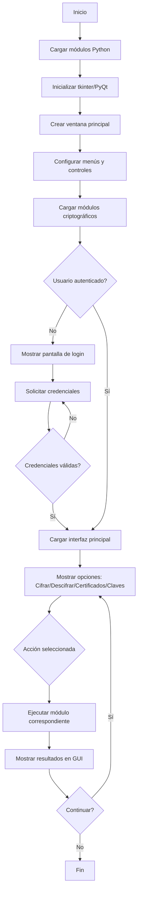

---

## 2. Cifrado Simétrico AES (CBC, CFB, OFB)

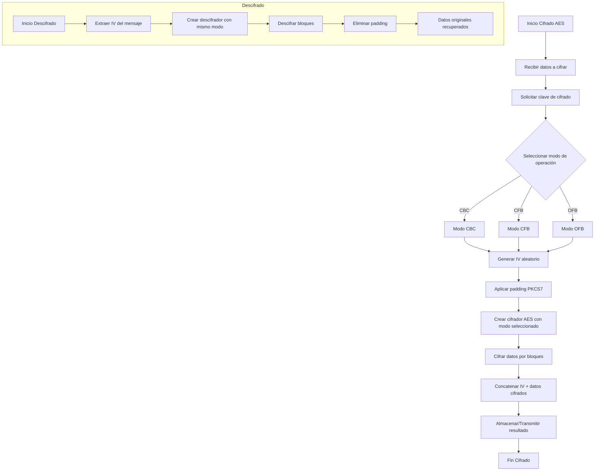

---

## 3. Generación de Vectores de Inicialización (IV)

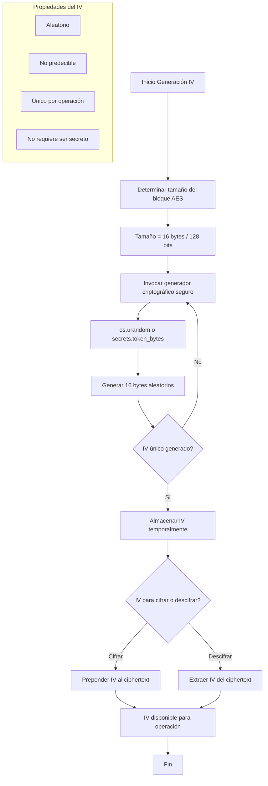

---

## 4. Algoritmo RSA con Relleno OAEP

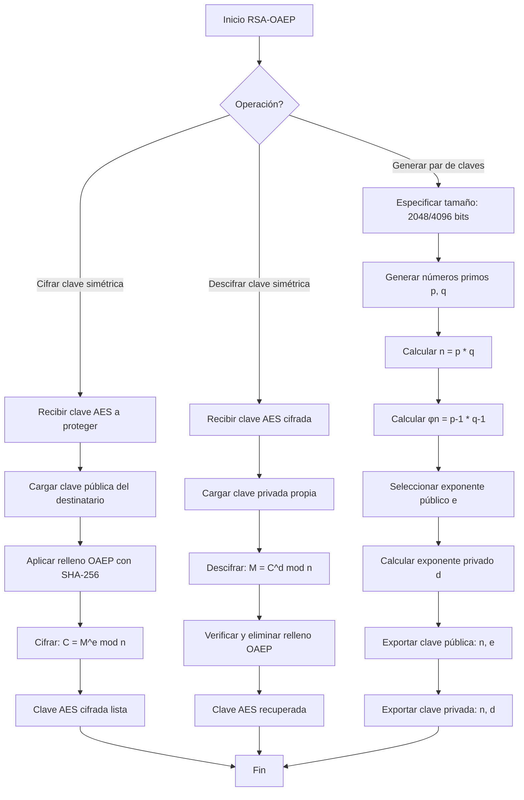

---

## 5. Autoridad de Certificación (CA) Local

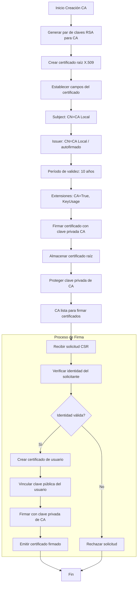

---

## 6. Emisión de Certificados Digitales

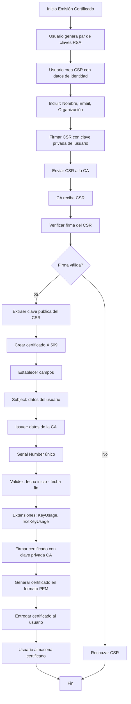

---

## 7. Protección de Claves Privadas con PBKDF2

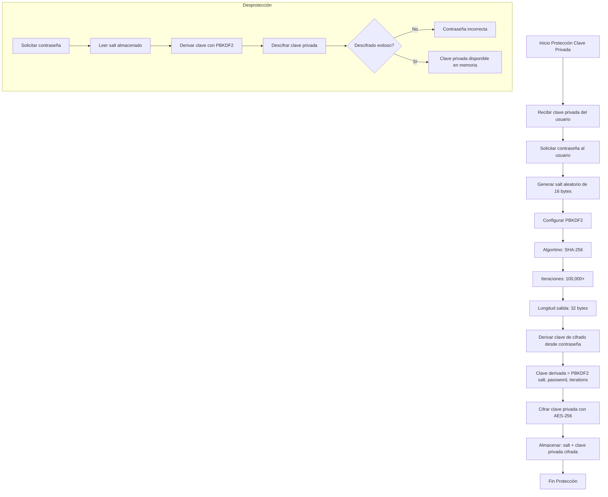

---

## 8. Sistema de Cifrado Híbrido (AES + RSA)

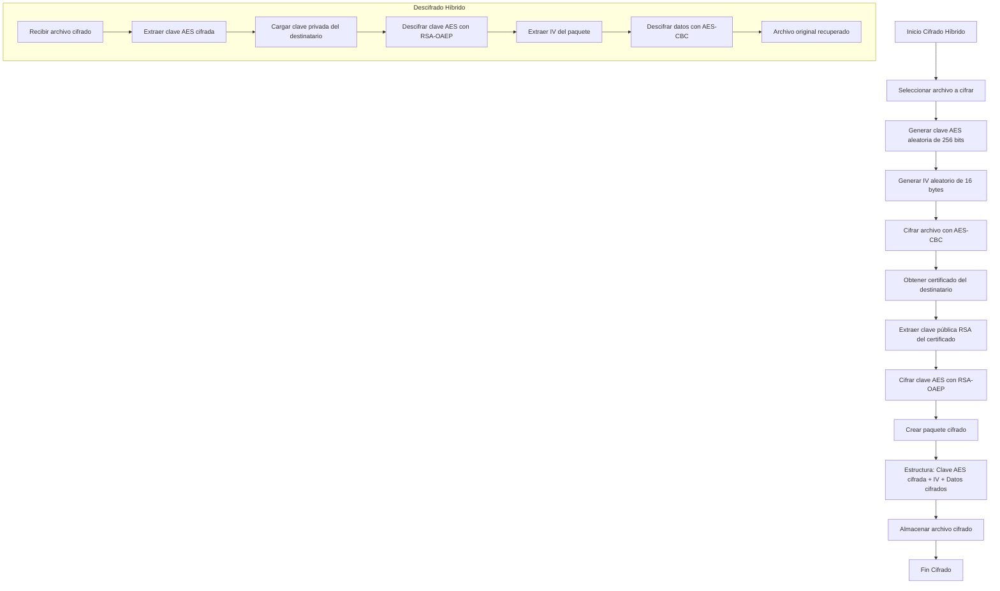

---

## 9. Cifrado para Múltiples Destinatarios

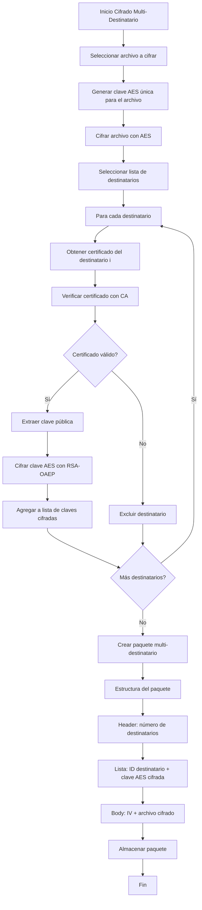

---

## 10. Recuperación Segura de Archivos

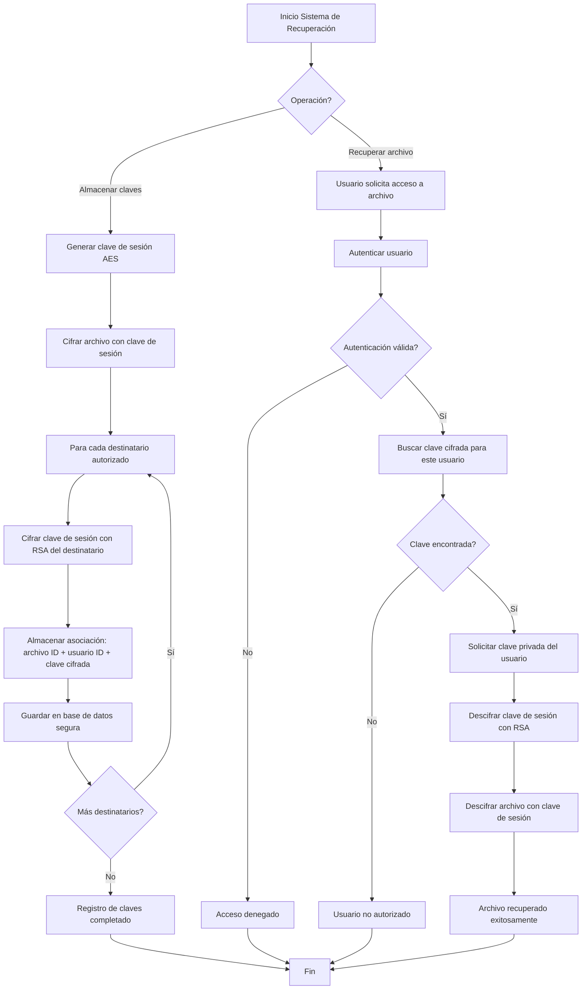

---

## Resumen Visual del Sistema Completo

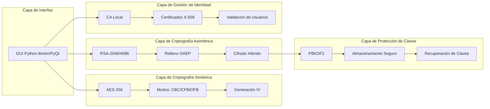

---

> [!NOTE]
> Estos diagramas representan el flujo lógico de cada objetivo. La implementación real puede variar según las bibliotecas utilizadas (como `cryptography` de Python) y los requisitos específicos del sistema.
